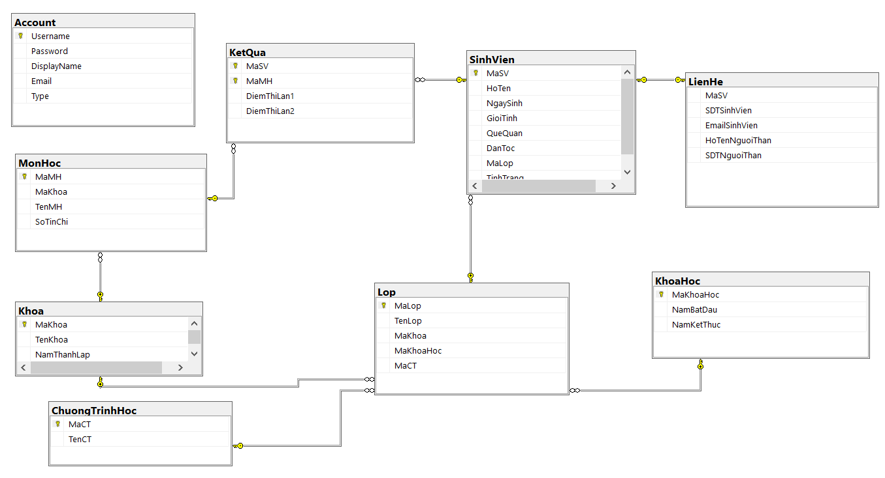
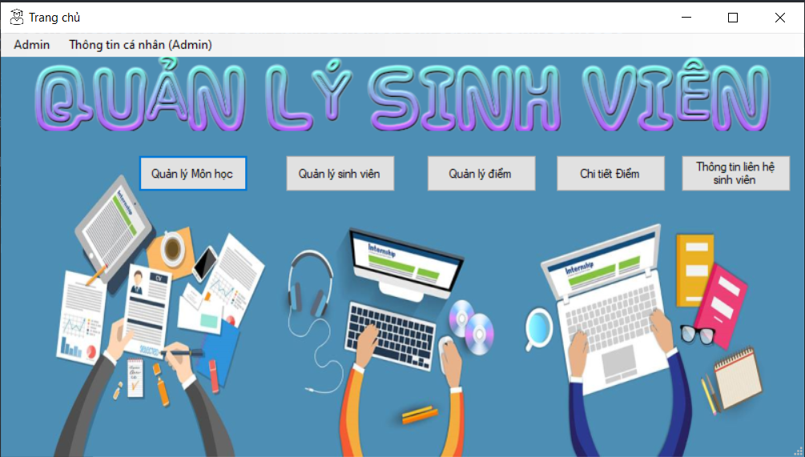
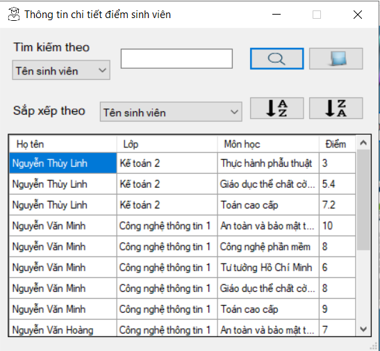
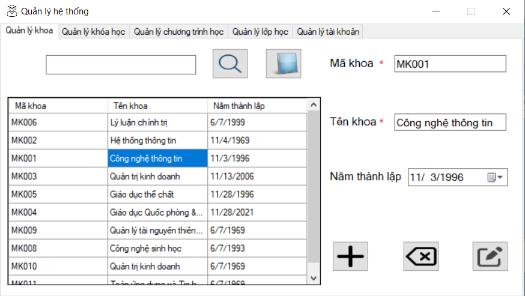

# Đồ án kết thúc môn học an toàn và bảo mật thông tin.
## Đề tài: Quản lý sinh viên - mã hóa dữ liệu.

## Lưu ý:
- Chức năng gửi email qua Gmail SMTP server không còn hoạt động kể từ 30/5/2022 [(Thông tin)](https://support.google.com/accounts/answer/6010255?hl=en)
- Có thể dùng Outlook service để thay thế [(Hướng dẫn)]([https://support.google.com/accounts/answer/6010255?hl=en](https://www.acodersjourney.com/how-to-send-email-using-csharp-and-outlook/)
- Do đó chức năng quên mật khẩu không còn khả dụng.
- Chức năng đăng nhập bằng mã xác thực không còn khả dụng.
- Ứng dụng có giao diện rất xấu, cân nhắc khi sử dụng.

# LÀM THẾ NÀO ĐỂ SỬ DỤNG?
#### B1. Clone code.
- Tạo một thư mục mới
- Mở cmd và chuyển đến thư mục này
- Chạy lệnh sau:
```sh
git clone https://github.com/ManhTuongNguyen/QuanLySinhVien.git
```

#### B2. Tạo cơ sở dữ liệu.
- Mở SQL Server Managerment Studio
- Tạo một query mới (Ctrl + N)
- Copy query từ file ```QLSV.sql``` (file nằm cùng cấp với các thư mục BLL, DAL, ...)
- Chạy query (F5)
#### B3. Chạy Project
- Mở project bằng visual studio (Project là thư mục chứa các thư mục BLL, DAL, ...)
- Chỉnh sửa chuỗi kết nối sql tại biến ```connectionString``` trong ```DAL\DataProvider.cs```
- Select Startup Item chọn GUI.csproj
- Chạy ứng dụng (Tài khoản: admin, mật khẩu: admin)


### Screenshot




